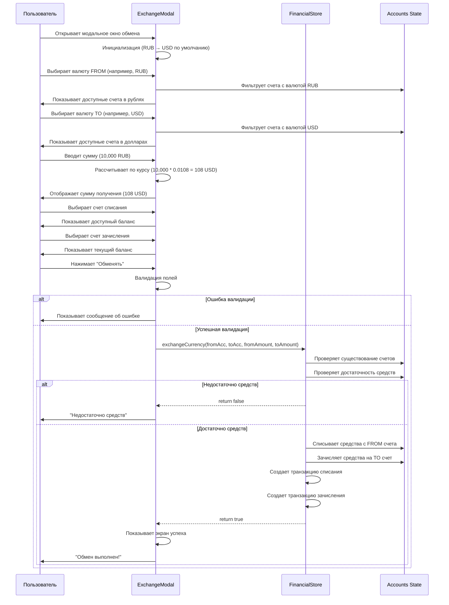
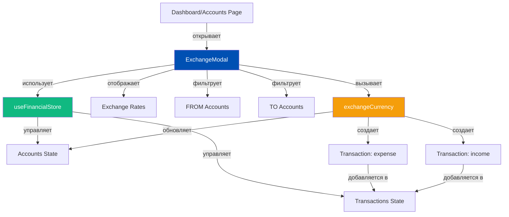
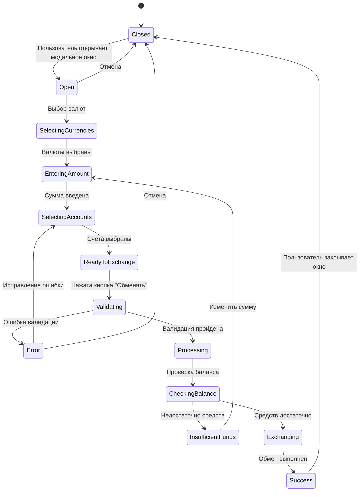
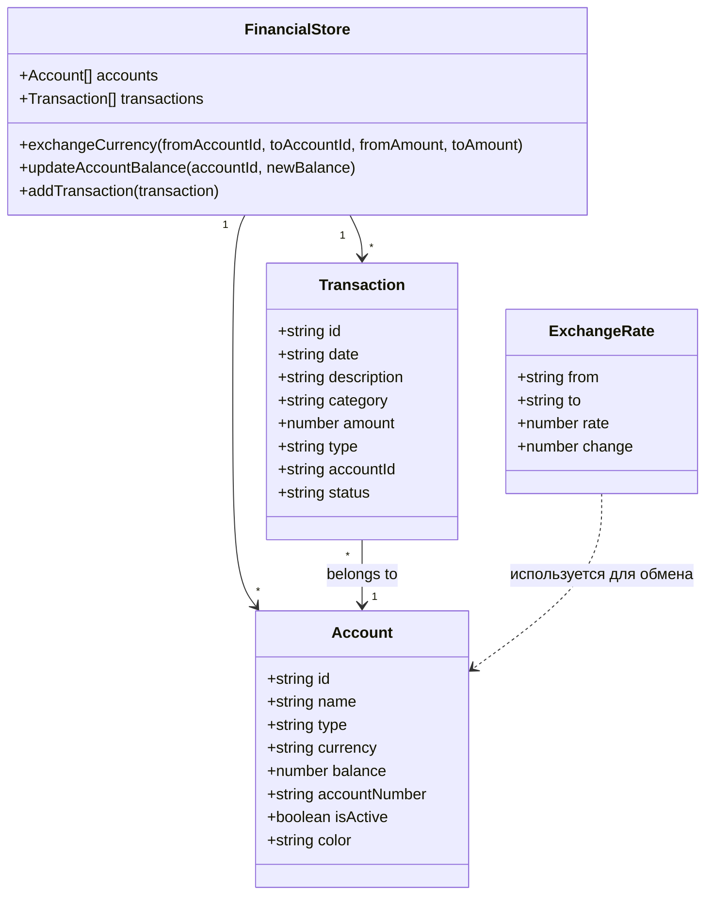
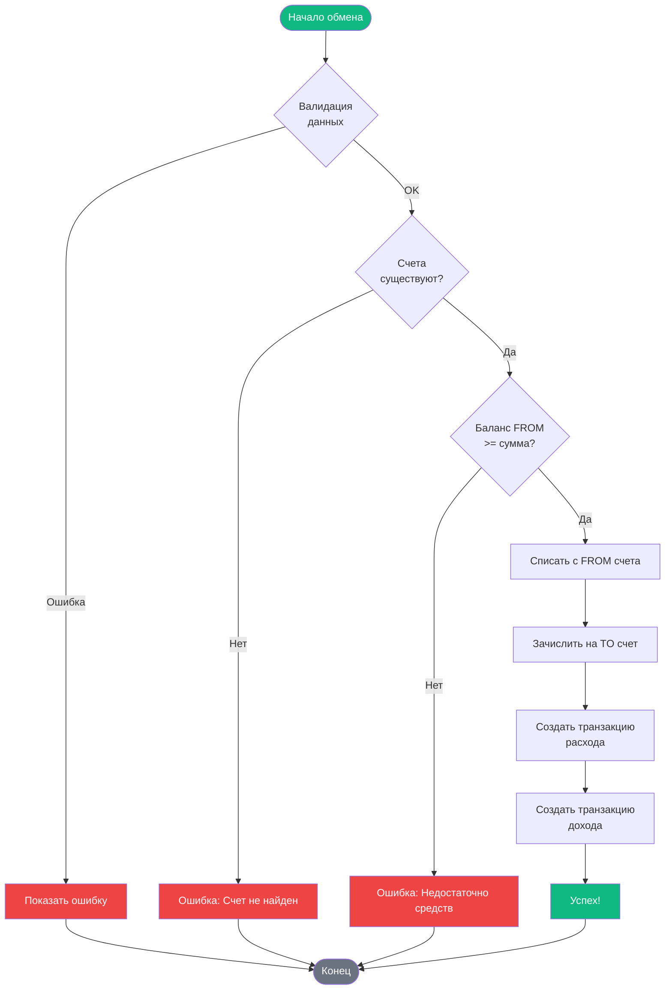

# Диаграмма процесса обмена валют

## Поток выполнения обмена



## Диаграмма компонентов



## Диаграмма состояний



## Структура данных



## Алгоритм обмена



## Расчет курса обмена

```
Пример:
- Пользователь хочет обменять 10,000 RUB на USD
- Курс RUB → USD = 0.0108
- Сумма получения = 10,000 × 0.0108 = 108 USD

Формула:
TO_AMOUNT = FROM_AMOUNT × EXCHANGE_RATE

Где:
- FROM_AMOUNT - сумма списания
- EXCHANGE_RATE - курс обмена валют
- TO_AMOUNT - сумма зачисления
```
